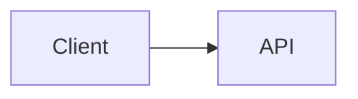

# NN — <Тема урока>

- **Дата:**
- **День челленджа:**
- **Время:**
- **Урок курса:**

## 0. Вспоминаю прошлый урок (по памяти, без подсказок)

-

## 1. Мой вариант до урока

<!-- Требования, компоненты, хранилище, узкие места. Криво — нормально. -->

## 2. Требования и оценки

- Functional:
- Non-functional:
- Нагрузка (RPS, объём данных, read/write ratio):

## 3. Решение из урока

<!-- Схема: ASCII или mermaid. -->

## 4. Ключевые решения и trade-offs

| Решение | Альтернатива | Почему выбрали | Цена решения |
|---------|--------------|----------------|--------------|
|  |  |  |  |

## 5. Что я упустил в своём варианте

-

## 6. Новые термины / концепции

-

## 7. Связь с MiniBank

<!-- Где это пригодится или уже пригодилось? Какой эксперимент можно поставить? -->

## 8. Объяснение за 3 минуты (как на собеседовании)

<!-- Пишу связным текстом, потом проговариваю вслух. -->

## 9. Вопросы, которые остались

-
